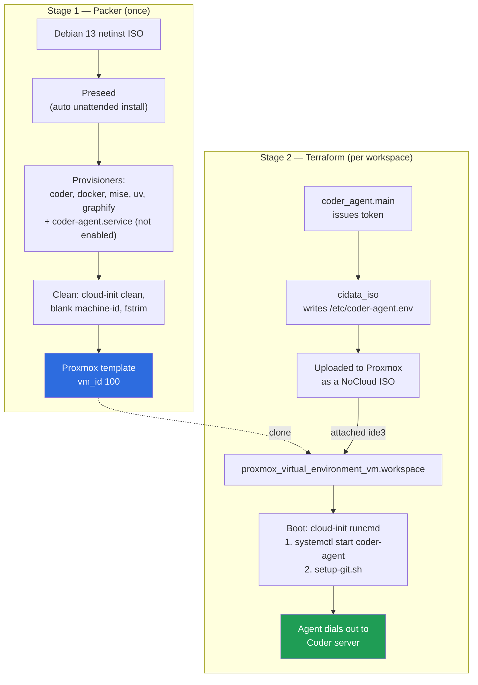

# proxmox-coder-template

Run [Coder](https://coder.com) workspaces as real Proxmox VMs.

This repo has two halves that work together:

| Stage | Tool | Artifact | Runs |
|---|---|---|---|
| 1. Bake | Packer (`packer/`) | A Proxmox VM **template** with Debian 13 + Coder agent + Docker + toolchain | Once (or when you want to refresh the image) |
| 2. Provision | Terraform (`template/`) | A workspace VM **cloned** from that template | Every time a user creates a workspace |

The core idea: install everything slow **once** at bake time, so workspace
creation is just a clone plus a tiny cloud-init ISO. With linked clones
(the default) a new workspace is near-instant.

---

## Repository layout

```
packer/
  coder-template.pkr.hcl   # the whole image build: preseed, provisioners, cleanup
  preseed-loader.cfg       # tiny chainloader fetched over HTTP at install time
  scripts/setup-git.sh     # baked into the image, run on first boot of a workspace
template/
  main.tf                  # Coder template: parameters, provider, VM, cloud-init
```

---

## How it works



### Stage 1 — the Packer build

`packer/coder-template.pkr.hcl` drives a fully unattended Debian install and
then layers tools on top.

**The two-preseed trick.** Debian's boot command line has a length limit, and a
full preseed is far too big to type in there. So the build uses two:

1. `boot_command` types `url=<preseed_loader_url>` — a 2-line file fetched over
   HTTP (by default straight from this repo's `main` branch on GitHub).
2. That loader's `preseed/early_command` mounts `/dev/sr1` — a second CD whose
   contents Packer generates inline from the `local.preseed` heredoc — and
   chainloads the real preseed from it.

So the *actual* install config lives in the `.pkr.hcl` file itself, not on
GitHub. Only the tiny bootstrapper is fetched remotely.

**What the preseed produces:** Debian 13, a single ext4 root filling `/dev/sda`
(no swap partition — `no_swap boolean false` just suppresses the installer's
warning about that), a passwordless-sudo `coder` user, SSH server, and a package
set including
`qemu-guest-agent`, `cloud-init`, `cloud-guest-utils` (for disk growth), `git`,
`jq`, `make`, and `gnupg`.

**What the provisioners add:**

- Coder CLI/agent (`coder.com/install.sh`, standalone)
- Docker CE + Compose plugin, with `coder` in the `docker` group
- `mise` (runtime version manager), `uv`/`uvx`, `graphify`
- `/home/coder/.local/bin/setup-git.sh` — baked in, invoked by cloud-init
- `/etc/systemd/system/coder-agent.service` — created and `daemon-reload`ed but
  deliberately **not** `systemctl enable`d. It reads `EnvironmentFile=/etc/coder-agent.env`,
  which does not exist until cloud-init writes it. Starting it is cloud-init's job.
- A verification provisioner that runs `--version` on everything, so a broken
  build fails loudly instead of shipping a silently-missing tool.

**Boot-time trimming** (every second here is paid on every workspace start):
`GRUB_TIMEOUT=0`, cloud-init restricted to `datasource_list: [NoCloud, None]`
so it stops probing EC2/Azure metadata endpoints and waiting on their timeouts,
and `apt-daily`/`man-db` timers disabled.

**Template hygiene:** `cloud-init clean --logs`, truncated `/etc/machine-id`,
removed dbus machine-id (so clones don't all share one host identity), apt cache
purged, then `fstrim -av` so the thin-provisioned template
only carries real data — which makes full clones and backups faster.

The template disk is only **4G**; workspaces request a larger disk at clone time.
`cloud-guest-utils` (growpart) is installed so cloud-init's default disk-resize
behavior can expand the root partition to fill it.

### Stage 2 — the Terraform Coder template

`template/main.tf` is what you push to Coder as a template. Providers: `coder`,
`bpg/proxmox`, and `freefair/cidata`.

**Cloud-init carries exactly one secret.** `cidata_iso.cloud_init` builds a
NoCloud ISO whose `user_data` is just this (plus a `meta_data` setting
`instance-id` and `local-hostname`):

```yaml
write_files:
  - path: /etc/coder-agent.env      # CODER_AGENT_TOKEN + CODER_AGENT_URL
runcmd:
  - systemctl start coder-agent     # first — so Coder connects immediately
  - su - coder -c '.../setup-git.sh "<name>" "<email>"'
```

Order matters and is commented as such in the source: `setup-git.sh` makes a
blocking `curl` to the Coder API, so the agent is started *first* and never
waits on it. The ISO is uploaded to Proxmox as a file resource, named
`coder-<workspace-id>-<hash8>.iso` so changing its content forces a new upload,
and attached at `ide3`.

Both commands live in `runcmd`, which cloud-init runs **once per instance** —
on first boot, not on every reboot. Since `coder-agent.service` is never
`systemctl enable`d, a workspace VM rebooted outside of Coder will not bring the
agent back up on its own.

**No `agent {}` block on the VM — on purpose.** Adding `agent { enabled = true }`
would make Terraform block workspace creation until `qemu-guest-agent` reports
an IP (30–60s plus a hang risk). Coder never needs the VM's IP: the agent dials
*out* to the Coder server. The VM is created and Terraform returns immediately.

**Admin floors vs. user choice.** Users pick CPU/memory/disk via
`coder_parameter`s, but every one is wrapped in `max(user_value, admin_default)`,
so a user can raise resources above the admin floor but never below it.

| Parameter | Mutable | Notes |
|---|---|---|
| `cpu_cores` | yes | floor `default_cpu_cores` |
| `memory_min` / `memory_max` | yes | ballooning floor / ceiling |
| `disk_size` | no | floor `default_disk_size` |
| `full_clone` | no | linked clone by default |
| `tags` | yes | merged on top of `default_tags` |

Some knobs are intentionally **not** user-facing — `vm_pool` (placement) and
`backup_vm_disk` (backup policy) are admin decisions, and the source says so.

**Tags** are normalized in `locals`: admin `default_tags` plus user tags,
lowercased, trimmed, non-conforming characters replaced with `-` (Proxmox only
accepts `[a-z0-9-_.+]`), then deduped and sorted. Admin tags can never be
removed by a user.

**Clone type.** Linked clones are the default (`default_full_clone = false`):
near-instant, but the workspace disk depends on the template, so you cannot
delete or heavily mutate template vm_id 100 while linked workspaces exist.
Full clones are independent but copy the whole disk.

### `setup-git.sh` — git identity and commit signing

Baked into the image, executed by cloud-init on a workspace's first boot with
the admin-configured author name/email. It:

1. Sets `user.name` / `user.email` (skipped when empty) and marks `$HOME` a git
   safe directory.
2. Rewrites `https://github.com/` → `git@github.com:` via `url.insteadOf`, so
   HTTPS clone URLs transparently use SSH.
3. Writes a modular `~/.ssh/config` (`Include config.d/*`) with
   `StrictHostKeyChecking accept-new` + `VerifyHostKeyDNS yes`.
4. Fetches the workspace's SSH key from Coder's agent API
   (`/api/v2/workspaceagents/me/gitsshkey`) using the agent token, then enables
   **SSH-based commit signing** — `gpg.format ssh`, `commit.gpgsign true`,
   `tag.gpgsign true`, plus an `allowed_signers` file so signatures verify locally.

The key fetch is best-effort: if it fails, git still works, just unsigned.

---

## Usage

### Prerequisites

- A Proxmox VE host, reachable over the API
- A Proxmox API token
- [Packer](https://developer.hashicorp.com/packer/install) with the `proxmox` plugin ≥ 1.2.4
- A running Coder deployment and the `coder` CLI

### Proxmox API token

Two tokens are used (they may be the same one, but least privilege is better —
the Packer token creates a template, the Terraform token clones VMs):

```bash
# on the Proxmox host
pveum user add packer@pve
pveum aclmod / -user packer@pve -role PVEAdmin
pveum user token add packer@pve build --privsep 0
```

Both stages expect the **full** token string in `USER@REALM!TOKENID=SECRET` form,
e.g. `packer@pve!build=xxxxxxxx-xxxx-xxxx-xxxx-xxxxxxxxxxxx`. The Packer config
splits it on `=` internally; do not pre-split it yourself.

### Step 1 — build the template image

```bash
cd packer
packer init coder-template.pkr.hcl

packer build \
  -var "proxmox_url=https://pve.example.com:8006/api2/json" \
  -var "proxmox_token=packer@pve!build=xxxxxxxx-xxxx-xxxx-xxxx-xxxxxxxxxxxx" \
  -var "proxmox_node=pve" \
  -var "vm_id=100" \
  coder-template.pkr.hcl
```

This takes a while (full Debian install + Docker + tooling). When it finishes
you have a Proxmox template named `coder-debian-template` at `vm_id`.

Useful variables:

| Variable | Default | Purpose |
|---|---|---|
| `proxmox_url` | — (required) | API URL, including `/api2/json` |
| `proxmox_token` | — (required) | `USER@REALM!ID=SECRET` |
| `proxmox_node` | `pve` | Node to build on |
| `vm_id` | `100` | Template VM ID — remember it, Terraform needs it |
| `disk_storage_pool` | `local-lvm` | Where the template disk lands |
| `iso_storage_pool` | `local` | Where ISOs are stored |
| `cloud_init_storage_pool` | `local-lvm` | Where the template's cloud-init drive lands |
| `iso_url` / `iso_checksum` | Debian 13.6 netinst | Override to pin another release |
| `iso_file` | `""` | Use an ISO already in Proxmox, e.g. `local:iso/debian.iso` (skips download) |
| `preseed_loader_url` | this repo on GitHub | Point at your own copy if you fork or run air-gapped |

> **Note:** the build fetches the preseed loader over HTTP from GitHub by
> default. If your Proxmox network cannot reach GitHub, host
> `packer/preseed-loader.cfg` somewhere reachable and set `preseed_loader_url`.

The build's throwaway install credentials (`root:root`, `coder:packer`) are only
used so Packer can SSH in during provisioning. Real workspaces are reached
through the Coder agent, not these passwords — but if you expose workspaces to
untrusted users, add a provisioner that locks or randomizes them.

### Step 2 — push the Coder template

```bash
cd template
coder templates push proxmox-vm -d .
```

Then set the variables in **Template Settings → Variables** (or pass a
`.tfvars` on push):

| Variable | Default | Purpose |
|---|---|---|
| `proxmox_endpoint` | `""` | e.g. `https://pve.example.com:8006/` |
| `proxmox_api_token` | `""` | `USER@REALM!ID=SECRET` (sensitive) |
| `proxmox_insecure` | `false` | `true` for self-signed certs |
| `proxmox_node` | `pve` | Node to create workspaces on |
| `template_vm_id` | `100` | **Must match the Packer `vm_id`** |
| `storage_pool` | `local-lvm` | Workspace disk storage |
| `iso_storage_pool` | `local` | Where the cloud-init ISO is uploaded |
| `network_bridge` | `vmbr0` | Bridge for the workspace NIC |
| `vm_pool` | `""` | Proxmox resource pool (admin-only) |
| `backup_vm_disk` | `false` | Include workspace disks in backups (admin-only) |
| `git_author_name` / `git_author_email` | `""` | Passed to `setup-git.sh` |
| `default_cpu_cores` | `2` | Minimum + default cores |
| `default_memory_min` / `default_memory_max` | `1024` / `2048` | Ballooning floor / ceiling (MB) |
| `default_disk_size` | `20` | Minimum + default disk (GB) |
| `default_full_clone` | `false` | `true` to force full clones |
| `default_tags` | `["coder"]` | Always-applied Proxmox tags |

`proxmox_endpoint` and `proxmox_api_token` default to empty strings, and the
`provider "proxmox"` block substitutes harmless placeholders
(`https://localhost:8006/` and a dummy token) when they are. That keeps
`terraform validate` and template import working before you've filled anything
in — but a workspace build will fail until you set the real endpoint and token.

### Step 3 — create a workspace

Users pick CPU, memory, disk, clone type, and extra tags in the Coder UI. On
create, Terraform clones the template, uploads a per-workspace cloud-init ISO,
and boots the VM. The agent connects on its own — typically within seconds on a
linked clone.

---

## Customizing

**Add tools to the image** — append a `provisioner "shell"` in
`coder-template.pkr.hcl` and add a `--version` check to the verification
provisioner, then rebuild and bump `vm_id` (or replace the template).

**Change first-boot behavior** — edit `packer/scripts/setup-git.sh`. It is baked
into the image, so this needs a rebuild. For things you want to change *without*
rebuilding, add them to the cloud-init `runcmd` in `main.tf` instead.

**Pin a different Debian release** — override `iso_url` + `iso_checksum`, and
check the `boot_command` still matches that installer's boot menu.

---

## Troubleshooting

| Symptom | Likely cause |
|---|---|
| Packer hangs at "waiting for SSH" | Preseed didn't run — check the VM console. Usually `preseed_loader_url` is unreachable from the Proxmox network, or the `boot_command` doesn't match the installer menu. `ssh_timeout` is 30m, so it fails slowly. |
| Workspace VM boots but Coder shows no agent | `/etc/coder-agent.env` missing or empty — cloud-init did not run. Check the ISO is attached at `ide3` and that `datasource_list` still includes `NoCloud`. |
| `systemctl status coder-agent` → inactive | Expected on the template itself (never enabled). On a workspace, it means cloud-init's `runcmd` didn't execute; check `/var/log/cloud-init-output.log`. |
| Commits unsigned | The gitsshkey fetch failed. It is best-effort and swallows errors, so git still works unsigned. Check the agent token and that the workspace can reach `CODER_AGENT_URL`. |
| Signatures don't verify locally | `allowed_signers` is only written when `user.email` is set. With `git_author_email` empty, signing is enabled but local verification isn't configured. |
| Disk didn't grow to the requested size | `cloud-guest-utils` / growpart issue — check `cloud-init` logs in the guest. |
| Can't delete the template VM | Linked clones still reference it. Delete those workspaces or use full clones. |
| Tags look mangled | `local.tags` replaces every character outside `[a-z0-9-_.+]` with `-`, so a tag of only special characters becomes a run of dashes. |

---

## Design notes worth knowing

These are non-obvious decisions the source explicitly justifies:

- **No `agent {}` block** on the VM resource — it would block workspace creation
  on a guest-agent IP report that Coder never needs.
- **`coder-agent.service` is created but not enabled** — it can't start before
  cloud-init writes its environment file. The trade-off: since `runcmd` is
  first-boot-only, a workspace rebooted outside of Coder won't restart the agent
  by itself. If you need reboot resilience, add `systemctl enable coder-agent`
  to the cloud-init `runcmd` (after the env file exists).
- **Agent starts before `setup-git.sh`** — the script makes a blocking API call
  and must not delay agent connection.
- **`fstrim` before finalizing** — keeps the thin-provisioned template small, so
  full clones and backups stay fast.
- **Linked clones by default** — the main reason workspace creation feels instant.
